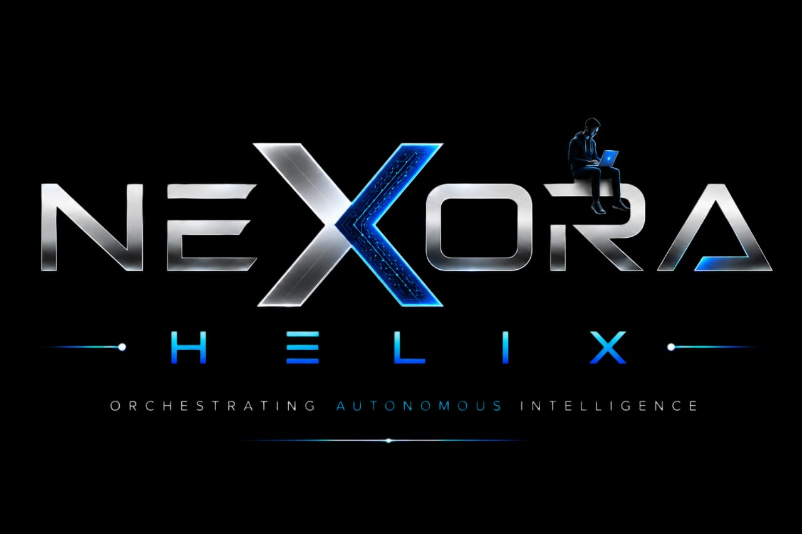

<div align="center">



### ⚙️ ORCHESTRATING AUTONOMOUS INTELLIGENCE ⚙️

**Building the Intelligence that Powers Tomorrow**

</div>

---

## 🔷 About Nexora Helix

Nexora Helix is an agentic AI platform forged for final-year project development — engineered across AI & Machine Learning, full-stack web development, and autonomous agentic systems. This repository holds the core application, built and deployed via Google AI Studio.

🔹 **Live Deployment:** https://nexora-helix.onrender.com

---

## 🔷 What We Offer

| | |
|---|---|
| 🧠 | AI & Machine Learning Projects |
| 💻 | Full Stack Web Development Projects |
| 🤖 | Agentic AI Solutions |
| 📦 | Source Code Included |
| 📄 | PPT & Documentation Included |
| 🎓 | IEEE & Custom Projects |
| 👥 | Individual & Team Projects |
| ⚙️ | Project Customization Available |
| 🎧 | Technical Mentorship & Support |

> **FROM IDEA TO DEPLOYMENT**
> Student Special Offers · Quality Projects, Real Impact · Reliable End-to-End Support · Building Tomorrow Together

---

## 🔷 Run Locally

**Prerequisites:** Node.js

```bash
npm install
```


```bash
npm run dev
```

---

## 🔷 Contact

| | |
|---|---|
| 📧 | shairfan2005@gmail.com |
| 📞 | 7200621273 |
| 🌐 | https://nexora-helix.onrender.com |

---

<div align="center">

**N E X O R A&nbsp;&nbsp;&nbsp; H E L I X**

*Building the Intelligence that Powers Tomorrow*

</div>
